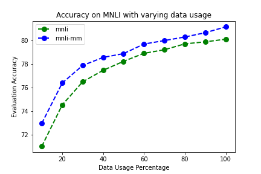
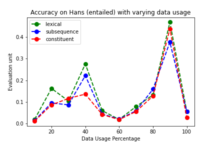
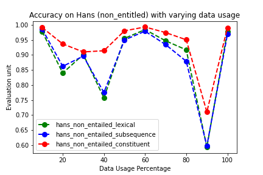
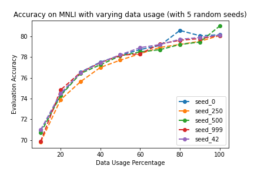
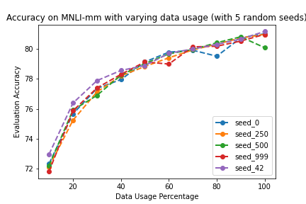
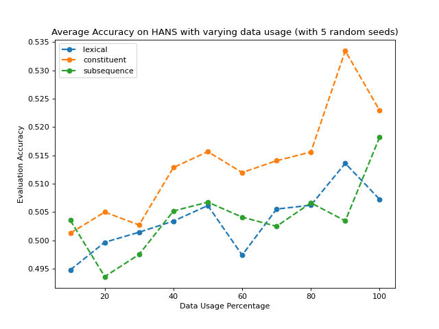
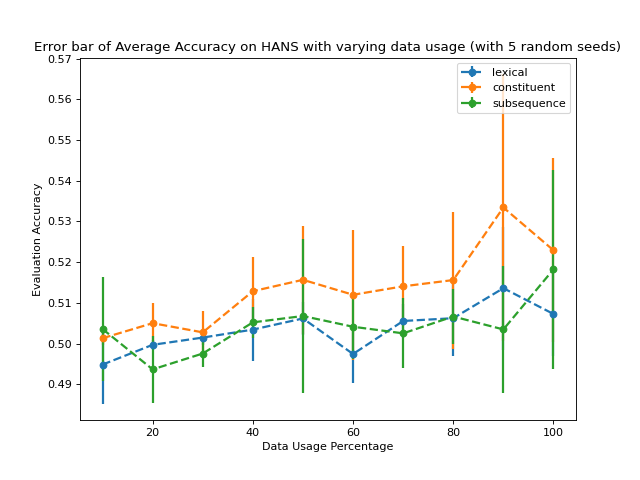

# transformers-importance-sampling
Importance Sampling with Transformers

- [x] Train Albert-base on MNLI
- [x] Extract ['CLS'] representations on MNLI from Albert
- [x] Random Sampling results on MNLI and Hans
- [ ] Clustering Analysis
- [ ] Re-train Albert-base models

For code formatting, run
```
make style
```

### Dependencies
- [Pytorch >= 1.5](https://github.com/pytorch/pytorch)
- [Transformers >= 2.9](https://github.com/huggingface/transformers)

### Results for Albert-base on MNLI
```
mnli/mnli-mm eval_acc: 80.11207 / 81.16354
epoch = 3.0
```
The model has been made publicly available at:
```
tokenizer = AutoTokenizer.from_pretrained("prajjwal1/albert-base-v1-mnli")

model = AutoModelForSequenceClassification.from_pretrained("prajjwal1/albert-base-v1-mnli")
```
Training was performed with mixed precision. The following command was used:
```
CUDA_VISIBLE_DEVICES=0 python3 run_glue.py   --model_name_or_path albert-base-v1   --task_name $TASK_NAME   --do_train   --do_eval   --data_dir $GLUE_DIR/$TASK_NAME/   --max_seq_length 128   --per_gpu_train_batch_size 512   --learning_rate 2e-5   --num_train_epochs 3.0   --output_dir /home/nlp/saved_models/   --fp16
```

### Extracting embeddings from Albert
```
CUDA_VISIBLE_DEVICES=0 python3 get_embeddings.py --model_name_or_path prajjwal1/albert-base-v1-mnli --task_name $TASK_NAME --data_dir $GLUE_DIR/$TASK_NAME --max_seq_len 128 --per_gpu_train_batch_size 512 --output_dir /home/nlp/experiments/
```

### Random Sampling Results on MNLI (with 5 seeds)

To run, random sampling tests, run the following command. You have to specify the percentage (`data_pct`). `0.1` means `10%`.
Additionally, also modify the `output_dir` accordingly. By default, models were trained for 3 epochs.

```
CUDA_VISIBLE_DEVICES=0 python3 subsampling_mnli.py   --model_name_or_path albert-base-v1   --task_name $TASK_NAME   --do_train   --do_eval   --data_dir $GLUE_DIR/$TASK_NAME/   --max_seq_length 128   --per_gpu_train_batch_size 512   --learning_rate 2e-5   --num_train_epochs 3.0   --output_dir /home/nlp/experiments/10_pct   --fp16 --data_pct 0.1
```

To run evaluation on HANS:
```
$ CUDA_VISIBLE_DEVICES=0 python3 test_hans.py   --model_name_or_path /home/nlp/experiments/albert-base-v1-mnli/  --do_eval   --data_dir /home/nlp/data/hans   --max_seq_length 128  --output_dir /home/nlp/experiments/hans/   --fp16 --task_name HANS --per_gpu_eval_batch_size 4096

$ cd /hans/directory
$ python3 evaluate_heur_output.py /predictions_from_previous_step (output_dir)
```


Results (seed 42):
```
| Data Percentage | eval_acc (mnli / mnli-mm) | Hans entailed/non-entailed (lexical overlap, subsequence, constituent) |
|-----------------|---------------------------|------------------------------------------------------------------------|
| 10              | 70.99337 /  72.95565      | (0.0196, 0.0146, 0.0118), (0.9776, 0.9858, 0.991)                      |
| 20              | 74.51859 /  76.38323      | (0.1626, 0.0956, 0.0866), (0.8396, 0.862, 0.9364)                      |
| 30              | 76.48497 /  77.87835      | (0.1046, 0.0866, 0.1164), (0.9012, 0.8958, 0.9098)                     |
| 40              | 77.46306 /  78.55980      | (0.276, 0.2222, 0.1364) , (0.7572, 0.775, 0.9138)                      |
| 50              | 78.22720 /  78.88527      | (0.0596, 0.044, 0.042)  , (0.9548, 0.9498, 0.98)                       |
| 60              | 78.90983 /  79.69894      | (0.0192, 0.021, 0.0184) , (0.984, 0.9786, 0.9926)                      |
| 70              | 79.21548 /  79.99735      | (0.0788, 0.0592, 0.056) , (0.9466, 0.934, 0.974)                       | 
| 80              | 79.71472 /  80.29902      | (0.1324, 0.159, 0.1278) , (0.9168, 0.8788, 0.9502)                     |
| 90              | 79.88792 /  80.66514      | (0.4688, 0.377, 0.4382) , (0.5936, 0.5972, 0.7106)                     |
| 100             | 80.11207 /  81.16354      | (0.0562, 0.0552, 0.028) , (0.9782, 0.9684, 0.9904)                      |
```




Results (seed 0):
```
| Data Percentage | eval_acc (mnli / mnli-mm) | Hans entailed/non-entailed (lexical overlap, subsequence, constituent) |
|-----------------|---------------------------|------------------------------------------------------------------------|
| 10              | 70.95262 /  72.32506      | (0.0048, 0.0024, 0.002) , (0.9946, 0.9772, 0.9992)                     |
| 20              | 74.33550 /  75.66110      | (0.1428, 0.082, 0.088)  , (0.8522, 0.8982, 0.9334)                     |
| 30              | 76.54610 /  77.35964      | (0.0002, 0.0002, 0.0)   , (1.0, 0.9988, 0.9996)                        |
| 40              | 77.51400 /  77.94955      | (0.1078, 0.1, 0.0846)   , (0.8782, 0.9128, 0.952)                      |
| 50              | 78.17626 /  79.12937      | (0.0596, 0.044, 0.042)  , (0.9548, 0.9498, 0.98)                       |
| 60              | 78.72643 /  79.78030      | (0.0106, 0.0076, 0.0062), (0.993, 0.991, 0.9984)                       |
| 70              | 79.12379 /  79.91253      | (0.1354, 0.2012, 0.2452), (0.876, 0.8294, 0.817)                       | 
| 80              | 80.57363 /  79.51095      | (0.0738, 0.1196, 0.128) , (0.932, 0.891, 0.9374)                       |
| 90              | 80.06113 /  80.72620      | (0.3278, 0.3198, 0.3194), (0.7384, 0.6798, 0.8228)                     |
| 100             | 80.15282 /  81.01098      | 0.3004, 0.3478, 0.2982) , (0.7402, 0.679, 0.802)                       |
```
Results (seed 250):
```
| Data Percentage | eval_acc (mnli / mnli-mm) | Hans entailed/non-entailed (lexical overlap, subsequence, constituent) |
|-----------------|---------------------------|------------------------------------------------------------------------|
| 10              | 69.81151 /  72.11147      | (0.0, 0.0, 0.0)          , (1.0, 1.0, 1.0)                             |
| 20              | 73.89709 /  75.23393      | (0.0, 0.0, 0.0002)       , (1.0, 1.0, 1.0)                             |
| 30              | 75.62913 /  77.12571      | (0.0, 0.0, 0.0)          , (1.0, 1.0, 1.0)                             |
| 40              | 77.00458 /  78.19365      | (0.0072, 0.0104, 0.0234) , (0.9952, 0.9974, 0.9938)                    |
| 50              | 77.70759 /  78.82424      | (0.0248, 0.1366, 0.1344) , (0.9832, 0.9526, 0.9454)                    |
| 60              | 78.32908 /  79.40398      | (0.0014, 0.009, 0.0284)  , (0.9986, 0.9924, 0.9886)                    |
| 70              | 78.93020 /  79.93287      | (0.0178, 0.0302, 0.0384) , (0.991, 0.9876, 0.9842)                     | 
| 80              | 79.22567 /  80.31936      | (0.0034, 0.0216, 0.0258) , (0.9986, 0.9934, 0.9872)                    |
| 90              | 79.52114 /  80.72620      | (0.01, 0.0686, 0.0612)   , (0.9938, 0.9972, 0.9776)                    |
| 100             | 80.08150 /  80.97030      |  0.057, 0.2076, 0.2072)  , (0.9288, 0.924, 0.8946)                     |
```
Results (seed 500):
```
| Data Percentage | eval_acc (mnli / mnli-mm) | Hans entailed/non-entailed (lexical overlap, subsequence, constituent) |
|-----------------|---------------------------|------------------------------------------------------------------------|
| 10              | 70.70809 /  72.20301      | (0.0002, 0.0, 0.0006)    , (1.0, 1.0, 0.9998)                          |
| 20              | 74.28425 /  75.91537      | (0.0, 0.0, 0.0)          , (1.0, 1.0, 1.0)                             |
| 30              | 76.42384 /  76.89178      | (0.0, 0.0, 0.0)          , (1.0, 1.0, 1.0)                             |
| 40              | 77.25929 /  78.24450      | (0.0122, 0.0384, 0.026)  , (0.997, 0.9804, 0.997)                      |
| 50              | 78.12531 /  79.01749      | (0.0, 0.0, 0.0)          , (1.0, 1.0, 1.0)                             |
| 60              | 78.50229 /  79.66842      | (0.0008, 0.0016, 0.0004) , (1.0, 1.0, 1.0)                             | 
| 70              | 78.71625 /  79.96338      | (0.0, 0.0008, 0.0008)    , (1.0, 1.0, 1.0)                             | 
| 80              | 79.21548 /  80.41090      | (0.0052, 0.0056, 0.0024) , (0.9996, 0.9978, 0.9994)                    |
| 90              | 79.44982 /  80.80756      | (0.001, 0.0044, 0.0034)  , (0.9998, 0.9996, 0.9998)                    |
| 100             | 80.99064 /  80.08150      | (0.0, 0.001, 0.0032)     , (1.0, 1.0, 1.0)                             |
```

Results (seed 999):
```
| Data Percentage | eval_acc (mnli / mnli-mm) | Hans entailed/non-entailed (lexical overlap, subsequence, constituent) |
|-----------------|---------------------------|------------------------------------------------------------------------|
| 10              | 69.89302 /  71.80634      | (0.1554, 0.1184, 0.018)  , (0.796, 0.9372, 0.9906)                     |
| 20              | 74.83443 /  75.86452      | (0.002, 0.0004, 0.0148)  , (0.9976, 0.9982, 0.9906)                    | 
| 30              | 76.51553 /  77.39015      | (0.0292, 0.0068, 0.0116) , (0.9794, 0.9872, 0.99)                      |
| 40              | 77.46306 /  78.29536      | (0.0046, 0.0178, 0.0024) , (0.9988, 0.9976, 0.9992)                    |
| 50              | 78.17626 /  79.12937      | (0.1234, 0.095, 0.0834)  , (0.9014, 0.8958, 0.9494)                    |
| 60              | 78.31889 /  78.98698      | (0.3334, 0.3696, 0.3784) , (0.6332, 0.6704, 0.7084)                    | 
| 70              | 79.26642 /  80.13628      | (0.0808, 0.0562, 0.0972) , (0.929, 0.9264, 0.9278)                     | 
| 80              | 79.62302 /  80.17697      | (0.0016, 0.001, 0.0046)  , (0.9988, 0.9986, 0.9932)                    |
| 90              | 79.78604 /  80.52278      | (0.0286, 0.021, 0.015)   , (0.9742, 0.97, 0.9864)                      |
| 100             | 80.08150 /  80.97030      | (0.0222, 0.0126, 0.0162) , (0.9896, 0.9866, 0.9894)                    |
```




